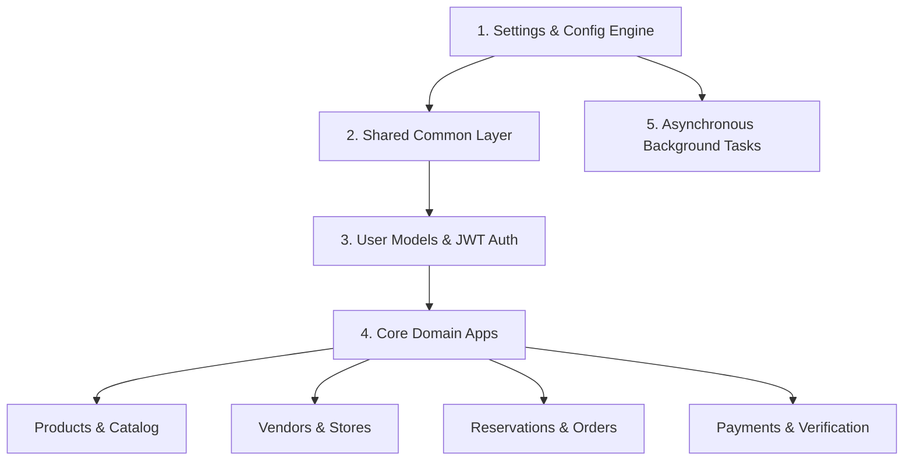
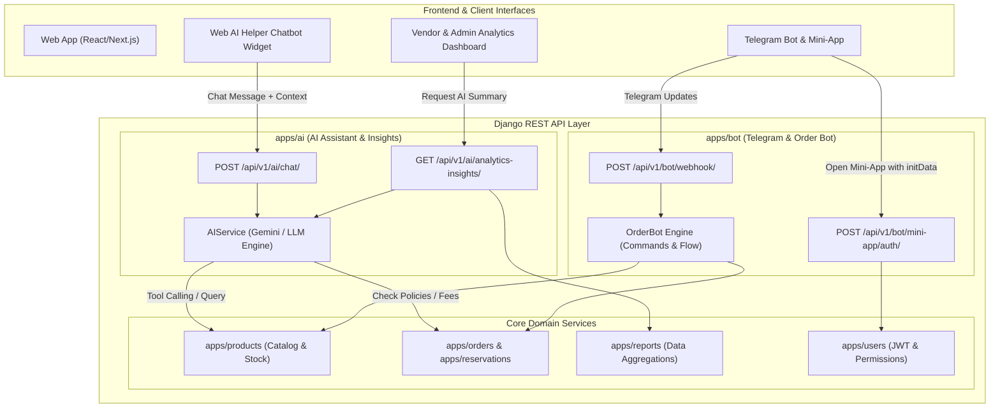

# Backend Architecture & Learning Guide

This document provides a step-by-step roadmap to explore, run, and develop the Django backend codebase of the **Uni-Student Cloth Rental and Sell** project.

---

## 🛠 Tech Stack Overview

| Layer | Technology | Purpose |
| :--- | :--- | :--- |
| **Framework** | Django 4.2 + Django REST Framework (DRF) | Core backend logic & API routing |
| **Authentication** | SimpleJWT (`djangorestframework-simplejwt`) | Token-based Auth (Access & Refresh JWTs) |
| **Database** | PostgreSQL | Relational storage for users, attire, orders, & transactions |
| **Caching & Broker** | Redis | Broker for background task queues & fast key-value store |
| **Task Queue** | Celery | Asynchronous background jobs (emails, order status sync) |
| **Containerization** | Docker & Docker Compose | Multi-container environment orchestration |

---

## 🗺 Learning Roadmap Overview

To understand how the backend works, follow the codebase in order of **data and execution flow**:



---

## 🚀 How to Run the Backend

You can run the backend using **Docker Compose** (recommended) or a **Local Virtual Environment**.

### Option A: Running with Docker (Recommended)

Make sure Docker Desktop is running, then in the project root directory:

```bash
# Start Postgres, Redis, and Backend API container
docker-compose up --build backend db redis

# Run Database Migrations
docker-compose exec backend python manage.py migrate

# Create a Superuser / Admin Account
docker-compose exec backend python manage.py createsuperuser
```

API Server will be live at: `http://localhost:8000/api/`  
Django Admin panel: `http://localhost:8000/admin/`

---

### Option B: Running Locally (Virtual Environment)

1. **Navigate to the backend directory & create a virtual environment:**
   ```bash
   cd backend
   python -m venv venv
   # Activate on Windows (PowerShell):
   .\venv\Scripts\Activate.ps1
   ```

2. **Install dependencies:**
   ```bash
   pip install -r requirements/dev.txt
   ```

3. **Set up local database settings and run migrations:**
   ```bash
   python manage.py migrate
   python manage.py createsuperuser
   ```

4. **Start the development server:**
   ```bash
   python manage.py runserver
   ```

---

## 📁 Directory Structure Breakdown

```
backend/
├── manage.py                # Django CLI entry point
├── Dockerfile               # Container build configuration
├── requirements/            # Dependencies (base.txt, dev.txt, prod.txt)
├── config/                  # Core Django Project Configuration
│   ├── settings/            # Modular settings (base.py, development.py, production.py)
│   ├── urls.py              # Root API Router
│   ├── celery.py            # Async worker settings
│   ├── wsgi.py & asgi.py    # Gateway interfaces
├── common/                  # Shared cross-app utilities
│   ├── permissions.py       # Role-Based Permissions (IsStudent, IsVendor, IsAdmin)
│   ├── pagination.py        # Standard pagination output formatting
│   ├── exceptions.py        # Custom API error handlers
│   └── validators.py        # File & input validations
└── apps/                    # Feature-specific Django Apps
    ├── users/               # Custom User model & profile models
    ├── verification/        # Student ID verification
    ├── vendors/             # Vendor store profiles & approvals
    ├── products/            # Clothes/Gowns catalog & stock
    ├── reservations/        # Rental duration & date locking
    ├── orders/              # Checkout, cart & order history
    ├── payments/            # Telebirr / Chapa payment gateways
    ├── discounts/           # Coupon codes & student discounts
    ├── reviews/             # Product ratings & feedback
    ├── notifications/       # Push & SMS notifications
    └── reports/             # Analytics for Admins & Vendors
```

---

## Step 1: Configuration & Root URLs

Start here to understand how settings are split into modular files and how API endpoints are routed.

| File | Description | Key Concepts |
| :--- | :--- | :--- |
| [`config/settings/base.py`](file:///c:/Users/Hp/rental/backend/config/settings/base.py) | Shared settings: `INSTALLED_APPS`, DRF JWT settings, Media URLs, Celery setup. | `AUTH_USER_MODEL`, `REST_FRAMEWORK` config |
| [`config/urls.py`](file:///c:/Users/Hp/rental/backend/config/urls.py) | Master routing file linking all `/api/` sub-routes to app urls. | `include()`, static/media asset serving |

💡 **Guiding Question while reading:** How does `config/urls.py` delegate endpoint paths like `/api/products/` or `/api/users/` to individual app URL modules?

---

## Step 2: User Authentication & Role Architecture

Learn how custom user roles (`STUDENT`, `VENDOR`, `ADMIN`) are stored and authenticated via JWT.

| File | Description | Key Concepts |
| :--- | :--- | :--- |
| [`apps/users/models.py`](file:///c:/Users/Hp/rental/backend/apps/users/models.py) | Extends `AbstractUser` to add `role`, `StudentProfile`, and `VendorProfile`. | `OneToOneField`, `ROLE_CHOICES` |
| [`apps/users/serializers.py`](file:///c:/Users/Hp/rental/backend/apps/users/serializers.py) | Converts User and Profile database instances to JSON payloads. | `ModelSerializer`, nested fields |
| [`apps/users/views.py`](file:///c:/Users/Hp/rental/backend/apps/users/views.py) | Handles user registration, login JWT generation, and profile fetching. | DRF `APIView`, `ViewSet`, JWT token responses |

💡 **Guiding Question while reading:** How does Django DRF authenticate requests using `rest_framework_simplejwt` token headers?

---

## Step 3: Shared Security & Utilities Layer (`common/`)

Examine how permissions and consistent response standards are enforced across all APIs.

| File | Description | Key Concepts |
| :--- | :--- | :--- |
| [`common/permissions.py`](file:///c:/Users/Hp/rental/backend/common/permissions.py) | Defines custom permission classes (`IsStudent`, `IsVendor`, `IsAdmin`). | `BasePermission`, `has_permission` override |
| [`common/pagination.py`](file:///c:/Users/Hp/rental/backend/common/pagination.py) | Custom pagination returning 12 items per page with page metadata. | `PageNumberPagination` |

💡 **Guiding Question while reading:** How does `IsVendor` prevent a student from modifying a vendor's attire inventory?

---

## Step 4: Modular Domain Apps

Explore the domain logic powering the rental marketplace:

1. **`apps/products/`**: Gown and attire catalog, categories, pricing per day, availability status.
2. **`apps/vendors/`**: Store profiles, store approval states, inventory management.
3. **`apps/reservations/`**: Logic for checking date availability and preventing double-booking of gowns.
4. **`apps/orders/`**: Rental/Purchase order generation, status transitions (`PENDING`, `CONFIRMED`, `PICKED_UP`, `RETURNED`).
5. **`apps/payments/`**: Integration with local payment methods (Telebirr/Chapa API webhooks).
6. **`apps/verification/`**: Student identity card upload & admin verification workflow.
7. **`apps/reports/`**: Core reporting aggregations (revenue, order counts, inventory turnover).

---

## 🤖 Step 5: AI Engine & Bot Ecosystem Architecture (Planned Integration)

This section details how the platform extends to support **Telegram Mini-Apps & Order Bots**, **Web AI Chatbots**, and **AI-Powered Analytics Boards**.



---

### 1. Telegram Mini-App & Order Bot (`apps/bot`)

The bot ecosystem provides a lightweight, frictionless channel for university students who prefer ordering directly through Telegram.

#### A. Core Concepts & Responsibilities
- **Webhook Gateway (`/api/v1/bot/webhook/`)**: Listens to real-time events and user messages from the Telegram Bot API.
- **Order Bot Engine**:
  - `/start`: Initiates bot conversation and links Telegram User ID to Django `User` model.
  - `/catalog`: Displays carousel cards of available ceremony attire with inline action buttons (*"Rent Now"*, *"View Details"*).
  - `/order <product_id>`: Multi-step conversational order wizard (dates, sizing, student discount confirmation, deposit).
  - `/myorders`: Real-time order tracking with due date countdowns and return reminders.
- **Telegram Mini-App Authentication (`initData` validation)**:
  - Cryptographically verifies the `initData` string sent by the Telegram Webview using the Bot Token secret key (HMAC-SHA256).
  - Automatically issues a standard JWT token to allow the embedded Mini-App to interact with all backend REST APIs.

#### B. Key Files & Structure for `apps/bot/`
```
apps/bot/
├── __init__.py
├── apps.py                  # Django AppConfig
├── urls.py                  # Routes /api/v1/bot/webhook/ and /mini-app/auth/
├── views.py                 # Webhook receiver & Mini-App JWT auth views
├── services/
│   ├── telegram_api.py      # Outbound Telegram Bot API client (send messages, cards, keyboards)
│   ├── auth_service.py      # HMAC-SHA256 validation for Telegram Mini-App initData
│   └── order_flow.py        # Conversational state machine for handling /catalog, /order, /myorders
└── models.py                # TelegramProfile (links telegram_id, chat_id to Django User)
```

---

### 2. AI Helper Chatbot on the Web (`apps/ai`)

An intelligent ceremonial attire assistant integrated into the web client to reduce support friction and help students pick the right ceremony gear.

#### A. Core Capabilities
- **Styling & Ceremony Advisor**: Uses Gemini / LLM with specialized system prompts containing faculty dress codes, graduation gown etiquette, and traditional attire matching.
- **Dynamic Tool Calling (Function Calling)**:
  - `check_product_availability(category, size, start_date, end_date)`
  - `calculate_rental_deposit(product_id, student_verified)`
  - `get_user_order_status(order_id)`
- **Context Injection**:
  - Automatically passes student university, faculty, and sizing measurements into prompt context for tailored recommendations.

#### B. Key Files & Structure for `apps/ai/`
```
apps/ai/
├── __init__.py
├── apps.py                  # Django AppConfig
├── urls.py                  # Routes /api/v1/ai/chat/, /api/v1/ai/stylist/
├── views.py                 # DRF APIViews handling chat payloads & session contexts
├── serializers.py           # Request validation (prompt, session_id, filters)
├── services.py              # LLM client wrapper (Google GenAI / OpenAI SDK)
├── prompts.py               # System prompts, role instructions, ceremony rules
└── tools.py                 # Function calling tools linking LLM to Django ORM queries
```

---

### 3. AI-Enhanced Analytics Board (`apps/reports` + `apps/ai`)

Enhances standard database reporting metrics with automated AI-generated business intelligence.

#### A. Core Capabilities
- **Executive Summaries & Trend Analysis**: Feeds weekly/monthly rental volumes, category revenues, and return compliance into the LLM to generate plain-language insights for Admins and Vendors (e.g., *"Engineering graduation peak expected in 2 weeks; Blue Hood inventory is at 92% utilization"*).
- **Natural Language Data Inquiries**: Allows vendors and administrators to type questions like *"Which ceremony attire generated the highest rental profit this month?"* and receive computed summaries and suggested actions.
- **Demand & Restock Forecasting**: Predicts high-risk stockout periods ahead of university graduation calendars.

---

## 🔍 Recommended 5-Point Self-Check per Backend App

Whenever you inspect a backend app in `apps/<app_name>/`, analyze these 5 components:
1. **`models.py`**: What database tables and relationships (`ForeignKey`, `OneToOneField`) are defined?
2. **`serializers.py`**: How is input validated and transformed into JSON?
3. **`views.py`**: Which DRF `ViewSet` or `APIView` methods handle HTTP verbs (`GET`, `POST`, `PUT`, `DELETE`)?
4. **`urls.py`**: What endpoint routes are registered with DRF `DefaultRouter`?
5. **`permissions.py`**: Who is allowed to access or mutate this resource (`IsAuthenticated`, `IsVendor`, etc.)?

