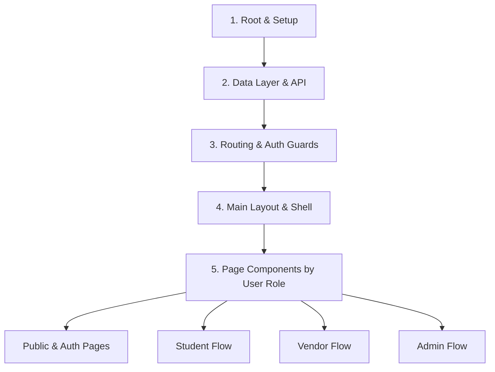

# Frontend Architecture & Learning Guide

This document provides a step-by-step roadmap to explore, understand, and learn the React frontend codebase of the **Uni-Student Cloth Rental and Sell** project.

---

## 🗺 Learning Roadmap Overview

To understand how the frontend works, follow the codebase in the order of **data and execution flow**:

---

## Step 1: Initialization & Root Setup (The Engine)

Start here to see how React initializes, attaches global styles, and sets up global providers.

| File | Description | Key Concepts |
| :--- | :--- | :--- |
| [`main.jsx`](file:///c:/Users/Hp/rental/frontend/src/main.jsx) | Application entry point. Mounts React to the DOM element (`root`) in `index.html`. | `React.StrictMode`, `createRoot`, global CSS imports |
| [`App.jsx`](file:///c:/Users/Hp/rental/frontend/src/App.jsx) | Root component that wraps the app in core providers. | `BrowserRouter`, `AuthProvider` wrapper |
| [`index.css`](file:///c:/Users/Hp/rental/frontend/src/index.css) | Global styles, Tailwind CSS directives, custom font imports, and theme tokens. | Tailwind `@tailwind`, custom utility classes |

💡 **Guiding Question while reading:** How do context providers wrap the application so that nested components gain access to state?

---

## Step 2: Global State & API Communication Layer

Understand how state is stored, persistent user sessions are handled, and HTTP requests are communicated to the backend API.

| File | Description | Key Concepts |
| :--- | :--- | :--- |
| [`api/axiosClient.js`](file:///c:/Users/Hp/rental/frontend/src/api/axiosClient.js) | Configures Axios instance with base URL (`http://localhost:5000/api`) and request headers. | Axios instance, interceptors, API configuration |
| [`api/authApi.js`](file:///c:/Users/Hp/rental/frontend/src/api/authApi.js) | Helper functions for making authentication endpoints (`login`, `register`). | Async functions, API data payload formatting |
| [`context/AuthContext.jsx`](file:///c:/Users/Hp/rental/frontend/src/context/AuthContext.jsx) | React Context managing `user` state, `token`, role information, and login/logout logic. | `createContext`, `useContext`, `localStorage`, `useState` |

💡 **Guiding Question while reading:** How does `localStorage` sync with React `useState` when the browser reloads?

---

## Step 3: Routing & Security Guards

Learn how URLs are mapped to pages and how unauthorized users are redirected.

| File | Description | Key Concepts |
| :--- | :--- | :--- |
| [`routes/AppRoutes.jsx`](file:///c:/Users/Hp/rental/frontend/src/routes/AppRoutes.jsx) | Defines all application routes (`/`, `/login`, `/student`, `/vendor`, `/admin`). | React Router `Routes`, `Route`, fallback 404 handler |
| [`routes/ProtectedRoute.jsx`](file:///c:/Users/Hp/rental/frontend/src/routes/ProtectedRoute.jsx) | Higher-Order Guard component protecting private pages based on authentication state and user roles. | Role-based Access Control (RBAC), `<Navigate />` redirection |

💡 **Guiding Question while reading:** If an unauthenticated user tries to visit `/admin`, how does `ProtectedRoute` detect and block them?

---

## Step 4: UI Layout & Common Shell Components

Examine the visual skeleton that wraps every page of the application.

| File | Description | Key Concepts |
| :--- | :--- | :--- |
| [`components/layout/MainLayout.jsx`](file:///c:/Users/Hp/rental/frontend/src/components/layout/MainLayout.jsx) | Top-level layout container housing Navbar, main content region (`children`), Footer, and global AI Chatbot. | React `children` prop, sticky footer layout, global chatbot overlay |
| [`components/layout/Navbar.jsx`](file:///c:/Users/Hp/rental/frontend/src/components/layout/Navbar.jsx) | Navigation bar displaying brand logo, links, role badge, cart button, and login/logout controls. | Dynamic conditional rendering based on `user.role` |
| [`components/layout/Footer.jsx`](file:///c:/Users/Hp/rental/frontend/src/components/layout/Footer.jsx) | Footer with links, copyright notice, and branding. | Responsive Tailwind grids and links |
| [`components/common/RoleSwitcher.jsx`](file:///c:/Users/Hp/rental/frontend/src/components/common/RoleSwitcher.jsx) | Development UI utility to quickly simulate switching user roles (`STUDENT`, `VENDOR`, `ADMIN`). | Quick role switching, testing UI states |
| [`components/chat/AIChatbot.jsx`](file:///c:/Users/Hp/rental/frontend/src/components/chat/AIChatbot.jsx) | Global AI Assistant floating widget providing instant FAQs, sizing guides, student discount instructions, and rental duration advice. | Floating drawer state, keyword pattern matching, quick action chips |

💡 **Guiding Question while reading:** How does `Navbar.jsx` dynamically change its navigation items depending on whether a Student or Vendor is logged in?

---

## Step 5: Page Components by Feature & User Role

Explore the pages in order of user workflow:

### 1. Public & Auth Pages (Front Door)
- [`pages/public/LandingPage.jsx`](file:///c:/Users/Hp/rental/frontend/src/pages/public/LandingPage.jsx): Hero banner, feature highlights, graduation gown showcase, CTA buttons.
- [`pages/auth/Login.jsx`](file:///c:/Users/Hp/rental/frontend/src/pages/auth/Login.jsx): User login form using `useAuth()` to submit credentials.
- [`pages/auth/Register.jsx`](file:///c:/Users/Hp/rental/frontend/src/pages/auth/Register.jsx): Registration form for new students/vendors with role selection.

### 2. Student Workflow (Browse & Rent)
- [`pages/student/CatalogPage.jsx`](file:///c:/Users/Hp/rental/frontend/src/pages/student/CatalogPage.jsx): Product catalog with filtering (category, size, price range), search bar, gown availability grid, and modal checkout.
- [`pages/student/StudentDashboard.jsx`](file:///c:/Users/Hp/rental/frontend/src/pages/student/StudentDashboard.jsx): Student overview dashboard showing active rentals, order statuses, return dates, and quick actions.

### 3. Vendor Workflow (Manage Listings & Orders)
- [`pages/vendor/VendorDashboard.jsx`](file:///c:/Users/Hp/rental/frontend/src/pages/vendor/VendorDashboard.jsx): Dashboard for gown vendors to add items, manage stock, view rental requests, approve orders, and track earnings.

### 4. Admin Workflow (Platform Governance)
- [`pages/admin/AdminDashboard.jsx`](file:///c:/Users/Hp/rental/frontend/src/pages/admin/AdminDashboard.jsx): Administrative control panel for user approvals, platform statistics, vendor management, and transaction logs.

### 5. Telegram Mini-App Mobile Workflow (`/miniapp`)
- [`pages/miniapp/MiniAppHome.jsx`](file:///c:/Users/Hp/rental/frontend/src/pages/miniapp/MiniAppHome.jsx): Compact mobile shop front tailored for Telegram WebApps (`window.Telegram.WebApp`), featuring category filters and instant gown browsing.
- [`pages/miniapp/MiniAppCheckout.jsx`](file:///c:/Users/Hp/rental/frontend/src/pages/miniapp/MiniAppCheckout.jsx): Quick mobile checkout flow with custom rental duration calculations, student ID discounts, and instant Pickup QR Code generation.

---

## 🔍 Recommended 5-Point Self-Check per Component

Whenever you open a `.jsx` component to study it, analyze these 5 points:
1. **Inputs (Props & Context)**: What data is passed in via `props` or hooks like `useAuth()`?
2. **State**: What dynamic data is tracked using `useState()`?
3. **Side Effects**: What logic triggers on mount or input change using `useEffect()`?
4. **Output (JSX)**: How is the visual layout rendered and formatted with Tailwind CSS?
5. **Mock Data Context**: Where is mock data defined and synced (e.g., local state, `localStorage`, or context)?
6. Review the dashboard analytics.

** https://uni-student-cloth-rental-andsell.vercel.app/ **